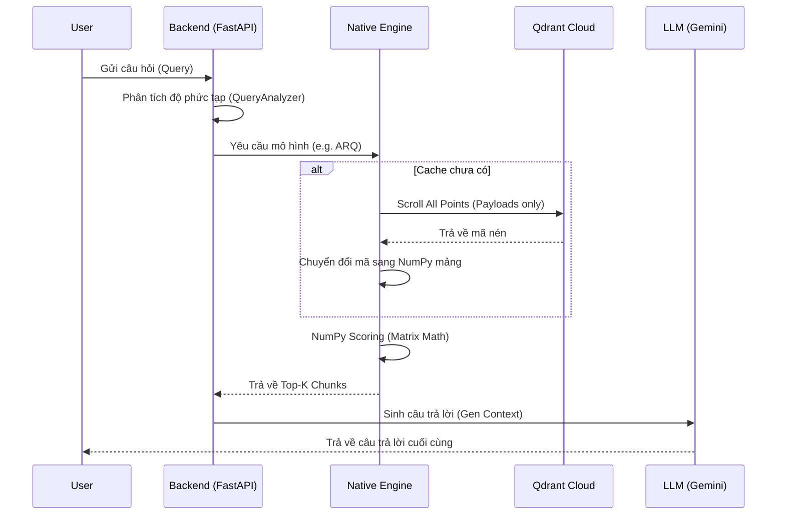

# Kiến trúc Hệ thống ARQ-RAG (TurboQuant)

Tài liệu này cung cấp cái nhìn chuyên sâu về kiến trúc luồng dữ liệu, quy trình nén và hệ thống đánh giá của dự án **ARQ-RAG**.

---

## 1. Kiến trúc Tổng thể (Hybrid Cloud-Native)

Hệ thống được thiết kế theo mô hình **Dumb Storage - Smart Backend**. Toàn bộ logic tìm kiếm và nén được đẩy về phía Backend CPU để tối ưu hóa khả năng kiểm soát và chứng minh hiệu năng thuật toán.

-   **Cloud Layer (Qdrant & Supabase)**:
    -   **Qdrant Cloud**: Lưu trữ Payload (mã nén, text). Các vector trong các collection nén là vector hằng số `[0.0, ...]`.
    -   **Supabase**: Lưu trữ lịch sử Benchmark, bảng kết quả RAGAS, và `model_weights.pkl`.
-   **Local Layer (FastAPI & Native Engine)**:
    -   **Native Engine**: Quản lý bộ nhớ RAM động, thực hiện tính toán ma trận bằng NumPy.
    -   **Chat Service**: Điều phối luồng xử lý từ lúc nhận query đến khi LLM trả lời.

---

## 2. Luồng Dữ liệu (System Flows)

### A. Cloud Pipeline (Ingestion & Quantization)
Quy trình chuẩn bị dữ liệu diễn ra hoàn toàn trên môi trường Cloud Scripts:

1.  **Ingestion**: `cloud_ingest.py` bóc tách PDF -> Chuyển thành Embeddings (Gemini) -> Lưu vào `vector_raw`.
2.  **Training**: `global_train.py` thực hiện huấn luyện các tâm cụm (centroids) và ma trận chiếu (`Pi`, `S`) từ dữ liệu `vector_raw`.
3.  **Re-Quantization**: `re_quantize.py` lấy dữ liệu từ `vector_raw`, áp dụng trọng số mô hình để sinh mã nén và ghi đè vào 4 collection: `adaptive`, `pq`, `sq8`, `arq`.

### B. Luồng Truy vấn Chat (Chat Flow)

### C. Luồng Đánh giá Tự động (Benchmark Flow)
Quy trình đánh giá hiệu năng diễn ra tự động thông qua API `/api/benchmark/run-test`:
1.  **Trigger**: Backend lấy tập câu hỏi mẫu từ Supabase.
2.  **Execution**: Chạy song song/tuần tự câu hỏi qua 5 mô hình khác nhau.
3.  **Monitoring**: `MemoryTracker` bắt đầu ghi lại RAM nền và RAM cao nhất.
4.  **Logging**: Mỗi kết quả được ghi vào bảng `benchmarks` kèm:
    - `retrieval_latency_ms`: Thời gian tính tại Native Engine.
    - `peak_ram_mb`: Mức tăng RAM cao nhất so với RAM nền.
5.  **RAGAS**: Chạy định kỳ để lấy điểm `faithfulness`, `relevancy` và lưu vào bảng `ragas_results`.

---

## 3. Quy ước 5 Mô hình So sánh

| Tên Mô hình | Loại Vector | Thuật toán Tính điểm | Đặc điểm Nén |
| :--- | :--- | :--- | :--- |
| **RAW** | Float32 | Cosine Similarity (Brute-force) | Lấy toàn bộ Context (`top_k = limit`) |
| **ADAPTIVE** | Float32 | Cosine Similarity (Focus Search) | Giống Raw nhưng chỉ lọc `top_k` tinh túy |
| **PQ** | Multi-uint8 | Subspace Centroid Lookup | Chia 32 subspaces, nén theo cụm |
| **SQ8** | Uint8 Scalar | De-quantized Dot Product | Min-Max scaling (4x nén) |
| **ARQ** | Mixed (idx,qjl) | **TurboQuant ADC Formula** | **Phân rã Thặng dư (Residual)** |

### Điểm khác biệt giữa RAW và ADAPTIVE:
- **RAW**: Ưu tiên tính đầy đủ. Nếu người dùng yêu cầu 20 chunks, hệ thống sẽ đưa cả 20 vào Prompt.
- **ADAPTIVE**: Ưu tiên tính chính xác. Hệ thống search rộng (ví dụ 100 chunks) nhưng chỉ chọn ra những chunks có điểm số cao nhất (ví dụ 5 chunks) để đưa vào Prompt, giúp giảm nhiễu cho LLM.

### Công thức ARQ (TurboQuant):
$Score = (MSE\_Scores + \alpha \cdot \gamma \cdot QJL\_Dot) \cdot Orig\_Norm$
- **MSE\_Scores**: Khoảng cách thô từ centroids.
- **QJL\_Dot**: Thành phần hiệu chỉnh thặng dư bằng 1-bit code.

---

## 4. Hệ thống Chỉ số Đánh giá (Metrics Definition)

### A. Hiệu năng Kỹ thuật
-   **Retrieval Latency (ms)**: Thời gian nội tại của CPU tại Local để tìm được Top-K. Loại bỏ độ trễ network.
-   **Base RAM (MB)**: Lượng RAM Backend chiếm dụng khi rảnh.
-   **Peak RAM (MB)**: Lượng RAM tăng thêm tối đa khi một mô hình được nạp và tìm kiếm.
-   **Load Time (s)**: Thời gian `scroll` dữ liệu từ Cloud về RAM (chỉ xảy ra ở lần switch model đầu tiên).

### B. Chất lượng Nội dung (RAGAS)
Hệ thống sử dụng Gemini-1.5-flash làm "Giám khảo" với các tham số:
-   **Faithfulness**: Độ trung thực của câu trả lời so với ngữ cảnh trích xuất.
-   **Answer Relevancy**: Độ liên quan của câu trả lời với câu hỏi gốc.
-   **Context Precision**: Tỷ lệ các chunk đúng nằm ở thứ hạng cao trong kết quả tìm kiếm.

---
*Tài liệu này là tài liệu kỹ thuật chính thống cho báo cáo Đồ án tốt nghiệp ARQ-RAG.*
