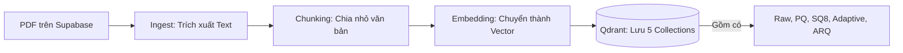
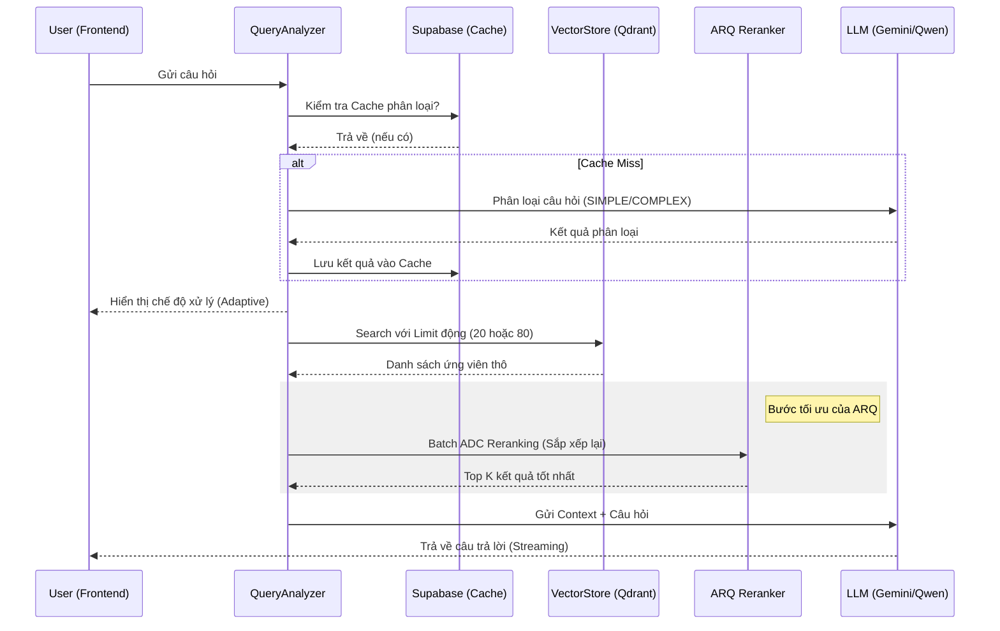

# Cấu trúc và Luồng hoạt động hệ thống ARQ-RAG

Hệ thống được thiết kế để so sánh hiệu năng giữa các phương pháp RAG truyền thống và phương pháp **ARQ-RAG (Adaptive Reranking Quantization)**.

## 1. Cấu trúc thư mục (Project Structure)

```text
DEMO_ARQ_RAG/
├── backend/                # Backend API (FastAPI)
│   ├── main.py             # Entry point, quản lý API endpoints
│   ├── chat_service.py     # Logic chính cho xử lý câu hỏi (Chat Stream)
│   ├── query_analyzer.py   # Phân loại câu hỏi (SIMPLE/COMPLEX) và quản lý Cache
│   ├── vector_store.py     # Tương tác với cơ sở dữ liệu vector Qdrant
│   ├── quantization.py     # Implement thuật toán ARQ, PQ, SQ8
│   ├── benchmark.py        # Trình chạy đánh giá (RAGAS, Latency, RAM)
│   ├── ingest.py           # Trích xuất dữ liệu từ PDF và cắt nhỏ (Chunking)
│   ├── embed.py            # Chuyển đổi văn bản thành Vector (Nomic Embed)
│   └── supabase_client.py  # Quản lý lưu trữ PDF và kết quả Cache trên Supabase
├── frontend/               # Giao diện người dùng (Next.js/React)
└── data/                   # Lưu trữ tạm các tệp local (.json, .npy)
```

## 2. Luồng hoạt động (System Workflow)

### A. Luồng Tiền xử lý dữ liệu (Ingestion Pipeline)


### B. Luồng Truy vấn ARQ-RAG (Retrieval & Generation)
Đây là trái tim của dự án, thể hiện tính "Adaptive":


## 3. Các thành phần chính và vai trò

- **TurboQuant (ARQ)**: Sử dụng kỹ thuật tích vô hướng trực tiếp trên dữ liệu đã nén để sắp xếp lại kết quả (Reranking) với tốc độ cực nhanh, giúp bù đắp sai số của quantization.
- **QueryAnalyzer**: Đóng vai trò là "bộ não" điều phối. Nó quyết định xem câu hỏi khó hay dễ để cấp tài nguyên tìm kiếm phù hợp, giúp cân bằng giữa **Độ chính xác (Accuracy)** và **Độ trễ (Latency)**.
- **Qdrant**: Cơ sở dữ liệu Vector lưu trữ 5 phiên bản khác nhau của cùng một dữ liệu để phục vụ việc Benchmark đối chứng.

---
> [!TIP]
> **Điểm nhấn của đồ án**: Chính là khả năng thích ứng (Adaptive) và việc sử dụng Supabase để cache kết quả phân loại, giúp hệ thống càng chạy càng nhanh hơn.
