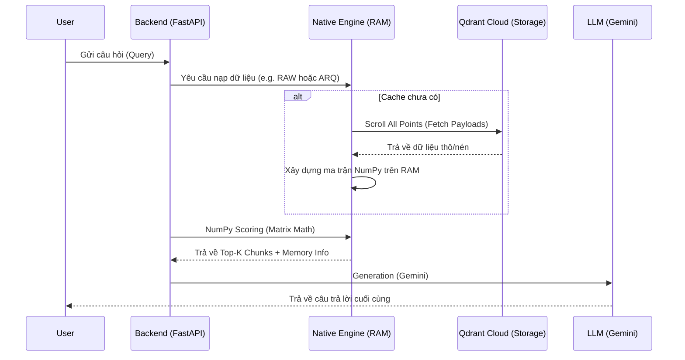

# Kiến trúc Hệ thống ARQ-RAG (TurboQuant)

Tài liệu này cung cấp cái nhìn chuyên sâu về kiến trúc luồng dữ liệu, quy trình nén và hệ thống đánh giá của dự án **ARQ-RAG**.

---

## 1. Kiến trúc Tổng thể (Hybrid Cloud-Native)

Hệ thống được thiết kế theo mô hình **Dumb Storage - Smart Backend**. Toàn bộ logic tìm kiếm và nén được đẩy về phía Backend CPU để tối ưu hóa khả năng kiểm soát và chứng minh hiệu năng thuật toán.

-   **Cloud Layer (Qdrant & Supabase)**:
    -   **Qdrant Cloud**: Lưu trữ Payload (mã nén, text). Các vector trong các collection nén là vector hằng số `[0.0, ...]`.
    -   **Supabase**: Lưu trữ lịch sử Benchmark, bảng kết quả RAGAS, và `model_weights.pkl`.
-   **Local Layer (FastAPI & Native Engine)**:
    -   **Native Engine**: Quản lý bộ nhớ RAM động, thực hiện tính toán ma trận bằng NumPy.
    -   **Chat Service**: Điều phối luồng xử lý từ lúc nhận query đến khi LLM trả lời.

---

## 2. Luồng Dữ liệu (System Flows)

### A. Cloud Pipeline (Ingestion & Quantization)
Quy trình chuẩn bị dữ liệu diễn ra hoàn toàn trên môi trường Cloud Scripts để tạo ra "Source of Truth":
1.  **Ingestion**: `cloud_ingest.py` bóc tách PDF -> Chuyển thành Embeddings (Gemini) -> Lưu vào `vector_raw`.
2.  **Training**: `global_train.py` huấn luyện các tâm cụm (centroids) và ma trận chiếu (`Pi`, `S`) từ dữ liệu thô.
3.  **Re-Quantization**: `re_quantize.py` sinh các mã nén và lưu vào các collection tương ứng trên Qdrant Cloud dưới dạng Pure Payload (không chứa vector).

### B. Luồng Truy vấn Native Chat

### C. Luồng Đánh giá Tự động (Benchmark Flow)
Quy trình đánh giá hiệu năng được thực hiện tập trung tại Backend:
1.  **Trigger**: API lấy tập câu hỏi mẫu từ Supabase.
2.  **Execution**: Chạy tuần tự qua 5 mô hình. Mỗi mô hình sẽ tải dữ liệu vào RAM Backend (nếu chưa có).
3.  **Monitoring**: `MemoryTracker` ghi nhận RAM Delta (mức tăng RAM thực tế của thuật toán).
4.  **Logging**: Mọi chỉ số (Latency, RAM, RAGAS) được lưu vào Supabase để đối soát.

---

## 3. Quy ước 5 Mô hình So sánh (Full-Native Mode)

Toàn bộ 5 mô hình dưới đây đều chạy trên **RAM Backend**. Sự khác biệt nằm ở khối lượng dữ liệu và thuật toán xử lý:

| Tên Mô hình | Nơi lưu trữ Vector | Thuật toán RAM | RAM Cost (Đồ án) |
| :--- | :--- | :--- | :--- |
- **Backend (Native Engine)**: Tự nạp mã nén từ Payload vào RAM và tự mình "vắt óc" tính toán search. Điều này chứng minh thuật toán ARQ có thể chạy độc lập mà không cần đến tính năng search của Database.

### Điểm khác biệt giữa RAW và ADAPTIVE:
- **RAW**: Ưu tiên tính đầy đủ. Nếu người dùng yêu cầu 20 chunks, hệ thống sẽ đưa cả 20 vào Prompt.
- **ADAPTIVE**: Ưu tiên tính chính xác. Hệ thống search rộng (ví dụ 100 chunks) nhưng chỉ chọn ra những chunks có điểm số cao nhất (ví dụ 5 chunks) để đưa vào Prompt, giúp giảm nhiễu cho LLM.

### Công thức ARQ (TurboQuant):
$Score = (MSE\_Scores + \alpha \cdot \gamma \cdot QJL\_Dot) \cdot Orig\_Norm$
- **MSE\_Scores**: Khoảng cách thô từ centroids.
- **QJL\_Dot**: Thành phần hiệu chỉnh thặng dư bằng 1-bit code.

---

## 4. Hệ thống Chỉ số Đánh giá (Metrics Definition)

### A. Hiệu năng Kỹ thuật
-   **Retrieval Latency (ms)**: Thời gian nội tại của CPU tại Local để tìm được Top-K. Loại bỏ độ trễ network.
-   **Base RAM (MB)**: Lượng RAM Backend chiếm dụng khi rảnh.
-   **Peak RAM (MB)**: Lượng RAM tăng thêm tối đa khi một mô hình được nạp và tìm kiếm.
-   **Load Time (s)**: Thời gian `scroll` dữ liệu từ Cloud về RAM (chỉ xảy ra ở lần switch model đầu tiên).

### B. Chất lượng Nội dung (RAGAS)
Hệ thống sử dụng Gemini-3.1-flash-lite-preview làm "Giám khảo" với các tham số:
-   **Faithfulness**: Độ trung thực của câu trả lời so với ngữ cảnh trích xuất.
-   **Answer Relevancy**: Độ liên quan của câu trả lời với câu hỏi gốc.
-   **Context Precision**: Tỷ lệ các chunk đúng nằm ở thứ hạng cao trong kết quả tìm kiếm.

---
*Tài liệu này là tài liệu kỹ thuật chính thống cho báo cáo Đồ án tốt nghiệp ARQ-RAG.*
