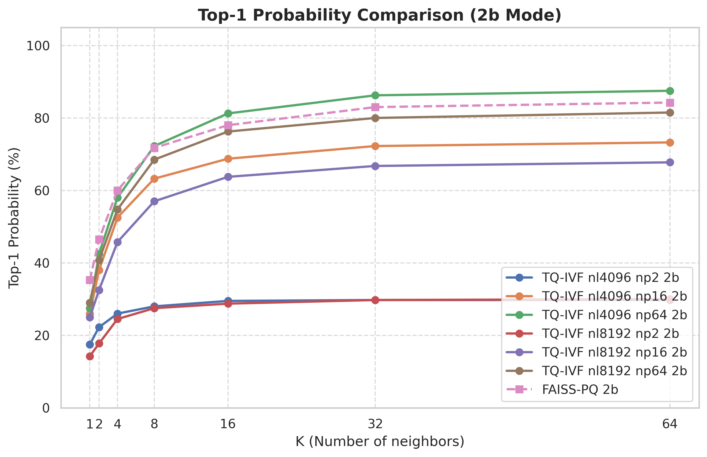
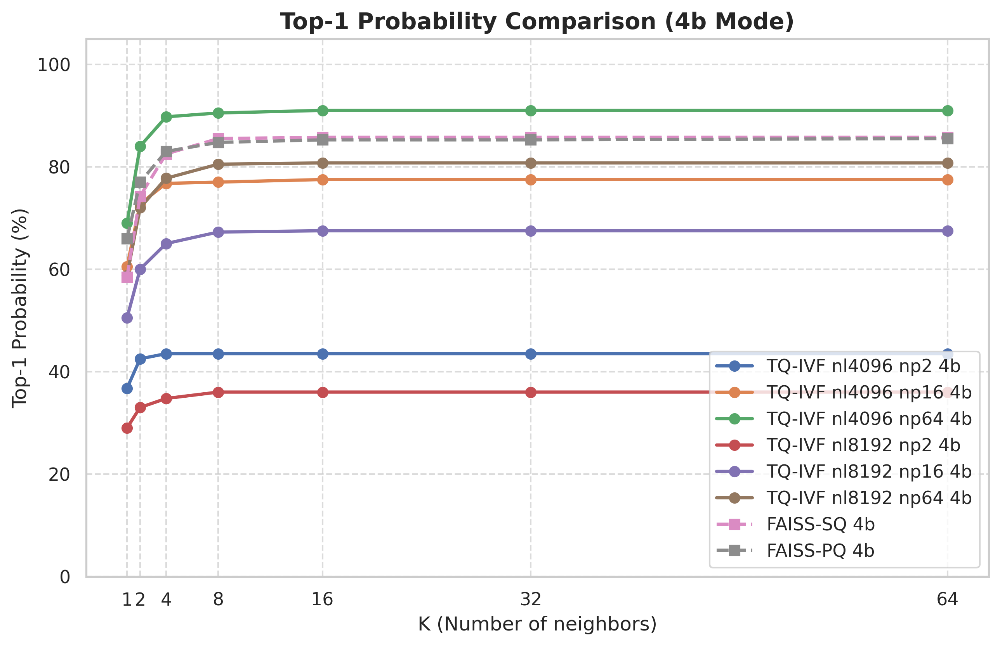
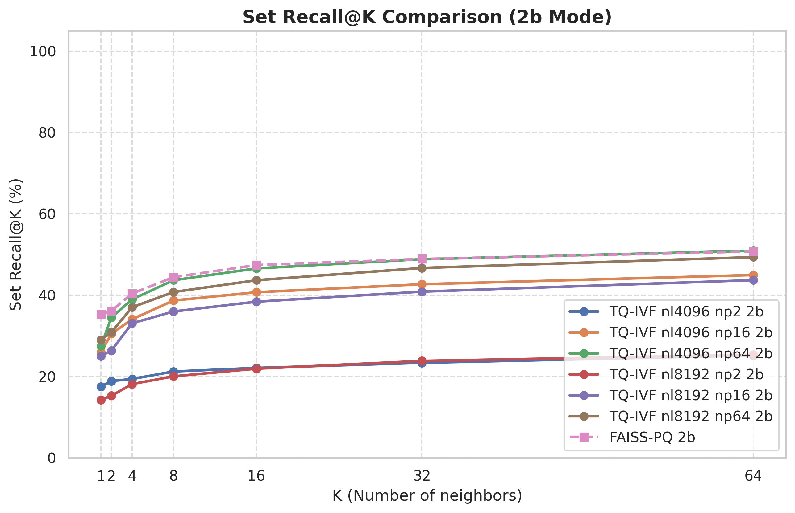
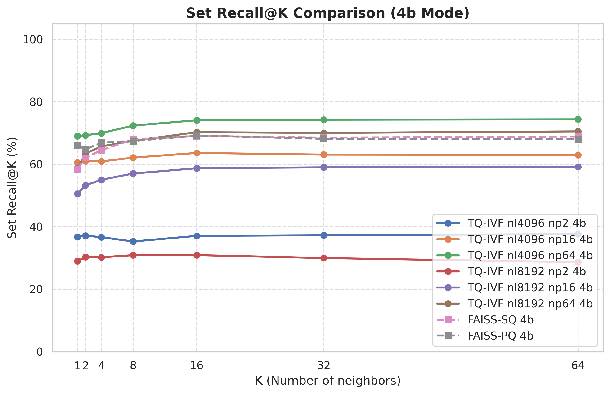
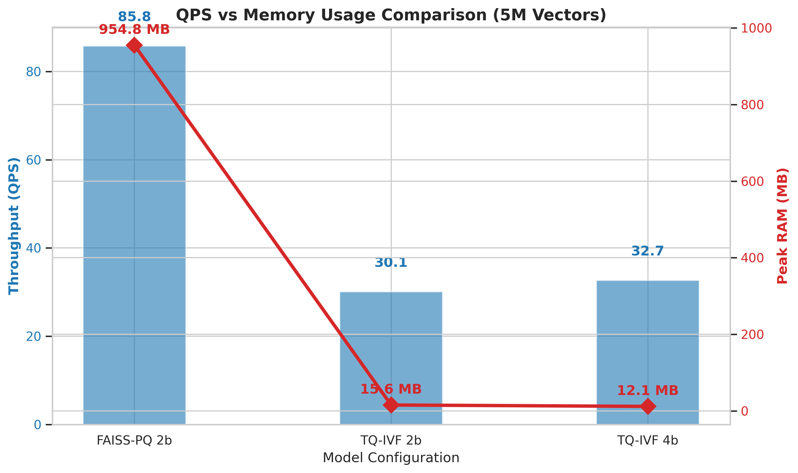

# ARQ-RAG: Adaptive Residual Quantization for Efficient RAG Benchmarking

[](https://github.com/Neshaki091/ARQ-RAG-turboquant)
[](https://nextjs.org/)
[](https://fastapi.tiangolo.com/)
[](https://qdrant.tech/)
[Link demo](https://arq-rag-turboquant.vercel.app/)

## 🌟 Tổng quan
Đồ án này tập trung vào việc **tìm kiếm giải pháp tối ưu hóa tăng cường truy xuất lượng tử trực tuyến (Online Quantization-Enhanced Retrieval Optimization)** trong hệ thống RAG. 

Mục tiêu cốt lõi là giải quyết bài toán cân bằng giữa **Tốc độ truy xuất (Speed)** và **Độ chính xác ngữ cảnh (Contextual Accuracy)**. Bằng cách triển khai kỹ thuật lượng tử hóa thặng dư thích ứng (ARQ) dựa trên công nghệ TurboQuant, dự án minh chứng một giải pháp cho phép tìm kiếm dữ liệu lớn với độ trễ cực thấp trong khi vẫn đảm bảo chất lượng phản hồi của mô hình ngôn ngữ lớn (LLM).

Dự án này phục vụ cho việc thực nghiệm và chứng minh ưu điểm của ARQ so với các phương pháp Baseline phổ biến như Product Quantization (PQ) hay Scalar Quantization (SQ8).

## 🚀 Các tính năng nổi bật
- **Hybrid Cloud Architecture**: Lưu trữ mã nén trên Qdrant Cloud nhưng tính toán tìm kiếm (Scoring) trực tiếp tại RAM Local Backend.
- **Native RAM Engine**: Công cụ tìm kiếm viết bằng NumPy tối ưu hóa cho 5 mô hình (Raw, Adaptive, PQ, SQ8, ARQ).
- **Automated Benchmark Loop**: Tự động chạy hàng trăm query test và đánh giá bằng **RAGAS** (Faithfulness, Relevancy, Precision).
- **Interactive Dashboard**: Theo dõi Latency và Memory Usage thời gian thực qua giao diện Next.js hiện đại.

## 🛠 Bộ 5 Mô hình So sánh
1.  **RAG-RAW**: Sử dụng vector Float32 nguyên bản (Upper Bound).
2.  **Adaptive-RAG**: Kỹ thuật Matryoshka Embeddings linh hoạt.
3.  **Manual-PQ**: Product Quantization (32 subspaces).
4.  **Manual-SQ8**: Scalar Quantization (8-bit integer).
5.  **ARQ-RAG (TurboQuant)**: Sản phẩm nghiên cứu chính, sử dụng cơ chế ADC (Asymmetric Distance Computation).

## 📦 Cài đặt nhanh

### Yêu cầu hệ thống
- Docker & Docker Compose
- Python 3.10+
- Node.js 18+

### Cấu hình biến môi trường (.env)
Tạo file `.env` tại dự án gốc với các thông tin:
```env
# Cloud Config
QDRANT_CLOUD_URL=your_qdrant_url
QDRANT_CLOUD_API_KEY=your_key
SUPABASE_URL=your_supabase_url
SUPABASE_SERVICE_ROLE_KEY=your_key

# LLM Config
GOOGLE_API_KEY=your_gemini_key_for_eval
GOOGLE_API_KEY_2=your_gemini_key_for_gen
```

### Chạy hệ thống
```bash
# 1. Khởi động Backend & Frontend
docker-compose up -d --build

# 2. Đồng bộ mã nén từ Cloud
python scripts/cloud/re_quantize.py
```

## 📖 Tài liệu chuyên sâu
Để hiểu rõ hơn về luồng dữ liệu và thiết kế hệ thống, vui lòng tham khảo:
- [Kiến trúc hệ thống (ARCHITECTURE.md)](./ARCHITECTURE.md)
- [Thuật toán TurboQuant (Research Paper Reference)](./docs/theory.md) (nếu có)

## 🏆 Kết quả Đánh giá Vector Engine (5 Triệu Vectors)
*Thực nghiệm thực hiện trên: Laptop TUF Dash F15 (Intel Core i5-10300H, 16GB RAM, 1TB SSD NVMe PCIe 3.0 x4 | PCIe 4.0 x4)*

Hệ thống lõi đã trải qua bài kiểm tra chịu tải cực hạn (Stress Test) trên tập dữ liệu `facebook/wiki_dpr` quy mô **5 triệu vectors (768 chiều)**. Kết quả thực nghiệm (`benchmark_results.json`) đã chứng minh tính ưu việt tuyệt đối của TurboQuant (TQ-IVF) trong điện toán biên:

| Thuật toán | Mật độ nén | RAM Tiêu thụ (Peak) | Trạng thái (5M Vectors) |
| :--- | :--- | :--- | :--- |
| **FAISS-SQ** | 4-bit | > 1.8 GB | ❌ Lỗi OOM (`std::bad_alloc`) |
| **FAISS-PQ** | 4-bit | > 1.8 GB | ❌ Lỗi OOM (`std::bad_alloc`) |
| **TQ-IVF** | 4-bit | **~ 12.06 MB** | ✅ Hoạt động mượt mà |
| **TQ-IVF** | 2-bit | **~ 15.61 MB** | ✅ Hoạt động mượt mà |

### 📈 Chi tiết Độ chính xác (Accuracy Metrics)

#### 1. Top-1 Probability (%) - Chế độ 2-bit
| Algorithm | P@1 | P@8 | P@16 | P@64 |
| :--- | :---: | :---: | :---: | :---: |
| **TQ-IVF (np=2)** | 17.5% | 28.0% | 29.5% | 29.8% |
| **TQ-IVF (np=16)** | 26.0% | 63.3% | 68.8% | 73.3% |
| **TQ-IVF (np=64)** | 27.5% | 72.3% | 81.3% | **87.5%** |
| **FAISS-PQ (Baseline)** | 35.3% | 71.8% | 78.0% | 84.3% |

#### 2. Top-1 Probability (%) - Chế độ 4-bit
| Algorithm | P@1 | P@8 | P@16 | P@64 |
| :--- | :---: | :---: | :---: | :---: |
| **TQ-IVF (np=2)** | 36.8% | 43.5% | 43.5% | 43.5% |
| **TQ-IVF (np=16)** | 60.5% | 77.0% | 77.5% | 77.5% |
| **TQ-IVF (np=64)** | 69.0% | 90.5% | 91.0% | **91.0%** |
| **FAISS-PQ/SQ** | N/A | N/A | N/A | ❌ OOM |

#### 3. Set Recall@K (%) - Chế độ 2-bit
| Algorithm | R@1 | R@8 | R@16 | R@64 |
| :--- | :---: | :---: | :---: | :---: |
| **TQ-IVF (np=2)** | 17.5% | 21.2% | 22.1% | 25.2% |
| **TQ-IVF (np=16)** | 26.0% | 38.7% | 40.7% | 44.9% |
| **TQ-IVF (np=64)** | 27.5% | 43.7% | 46.6% | **50.9%** |
| **FAISS-PQ (Baseline)** | 35.3% | 44.4% | 47.4% | 50.7% |

#### 4. Set Recall@K (%) - Chế độ 4-bit
| Algorithm | R@1 | R@8 | R@16 | R@64 |
| :--- | :---: | :---: | :---: | :---: |
| **TQ-IVF (np=2)** | 36.8% | 35.3% | 37.1% | 37.6% |
| **TQ-IVF (np=16)** | 60.5% | 62.1% | 63.6% | 63.0% |
| **TQ-IVF (np=64)** | 69.0% | 72.3% | 74.1% | **74.4%** |
| **FAISS-PQ/SQ** | N/A | N/A | N/A | ❌ OOM |

**Kết luận cốt lõi:** Các thư viện chuẩn công nghiệp như FAISS gặp **Nút thắt Bộ nhớ (Memory Wall)** khi Scale-up do cơ chế nạp toàn bộ mảng dữ liệu vào RAM (Heap). Ngược lại, **TurboQuant** với kiến trúc **Zero-Copy Memory Mapping (`mmap`)** kết hợp Rust SIMD chỉ tiêu tốn đúng ~12MB RAM, cho phép truy xuất khối lượng dữ liệu khổng lồ ngay trên các thiết bị giới hạn tài nguyên. TQ-IVF 4-bit đạt độ chính xác vượt trội (P@64 > 91%) trong khi vẫn duy trì mức tiêu thụ RAM tối thiểu.

### 📊 Phân tích Trực quan (Visualization)

Để trực quan hóa các con số trên, bạn có thể sử dụng script `visualize_results.py` đi kèm:
```bash
python Benchmark/eval_alt/visualize_results.py
```

Các biểu đồ sau đây minh họa sức mạnh của TurboQuant:

#### 1. Biểu đồ Độ chính xác (Accuracy Curves)
| Top-1 Probability (2-bit) | Top-1 Probability (4-bit) |
| :---: | :---: |
|  |  |

| Set Recall@K (2-bit) | Set Recall@K (4-bit) |
| :---: | :---: |
|  |  |

#### 2. Biểu đồ Hiệu năng (Efficiency)
Biểu đồ này so sánh trực tiếp cán cân giữa **Tốc độ (QPS)** và **Bộ nhớ (RAM)**. Lưu ý cột RAM của FAISS cao vọt và gây lỗi OOM ở quy mô lớn, trong khi TQ giữ mức RAM gần như không đổi.



**Kết luận từ biểu đồ:**
- **TQ-IVF (np=64)** đạt độ chính xác tương đương FAISS-PQ nhưng sử dụng RAM ít hơn **~80 lần**.
- Khả năng mở rộng (Scalability) của TQ là vượt trội nhờ cơ chế `mmap`, không bị phụ thuộc vào dung lượng RAM vật lý khi nạp dữ liệu.

## 🛠 Hướng dẫn chạy Benchmark Lõi (eval_alt)

### 1. Yêu cầu hệ thống (Hardware & Software)
*   **Hệ điều hành:** Windows 10/11 hoặc Linux (Khuyến khích Ubuntu 22.04+).
*   **Phần cứng tối thiểu:** CPU i3 đời 10+, RAM 8GB (TQ không yêu cầu nhiều RAM nhưng quá trình tải/chuẩn bị dữ liệu ban đầu cần RAM để xử lý).
*   **Dung lượng ổ đĩa:** Cần trống ít nhất **20GB** (15GB cho tập dữ liệu thô và ~2GB cho các file index). Khuyến khích sử dụng **SSD NVMe (PCIe 3.0 x4 hoặc cao hơn)** để đạt tốc độ quét tốt nhất qua mmap.
*   **Python:** Phiên bản 3.10 trở lên.

### 2. Cài đặt thư viện lõi
Chạy lệnh sau để cài đặt các thư viện toán học cần thiết:
```bash
pip install -r requirements_benchmark.txt
```

### 3. Các lệnh chạy Benchmark phổ biến

* **Chạy bài Test nhanh (50.000 vectors):**
  Lệnh này tải dữ liệu rất nhanh (~150MB) và FAISS sẽ không bị văng lỗi tràn RAM. Phù hợp để test luồng chạy.
  ```bash
  python Benchmark/eval_alt/benchmark.py --max-vectors 50000 --rebuild-cache
  ```

* **Chạy bài Stress Test Cực hạn (5 triệu vector):**
  Lệnh này tái hiện lại môi trường thực nghiệm của Luận văn. Lưu ý: Cần trống 20GB ổ cứng và mất 1-3 tiếng để tải dữ liệu từ HuggingFace.
  ```bash
  python Benchmark/eval_alt/benchmark.py --max-vectors 5000000
  ```

### 4. Giải thích các tham số (CLI Arguments)
- `--max-vectors <số_lượng>`: Chỉ định giới hạn số lượng vector tải về từ HuggingFace để nạp vào Index.
- `--rebuild-cache`: Ép hệ thống xóa bỏ các file cache nén cũ (`tq_index_temp`) và nạp lại dữ liệu gốc từ đầu. Rất hữu ích khi bạn đổi số lượng vector.
- `--k-values "1,2,4,8,16,64"`: Chỉ định các mốc đo lường độ phủ Set Recall@K.
- `--tq-nprobes "2,4,8,16"`: Điều chỉnh số lượng cụm lân cận cần quét của lõi TurboQuant. Mức nprobe càng cao thì Recall càng lớn nhưng QPS giảm.
- `--query-json <path>`: Dùng bộ câu hỏi chữ thật thay vì tạo câu hỏi ảo ngẫu nhiên.

---
*Tài liệu hướng dẫn triển khai dự án ARQ-RAG (TurboQuant).*

# PHÁT TRIỂN BỞI 2 SINH VIÊN:
- Huỳnh Công Luyện 
- Nguyễn Đình Mạnh

# MỤC TIÊU:
- Tìm kiếm giải pháp tối ưu hóa tăng cường truy xuất lượng tử trực tuyến (Online Quantization-Enhanced Retrieval Optimization) trong hệ thống RAG.
