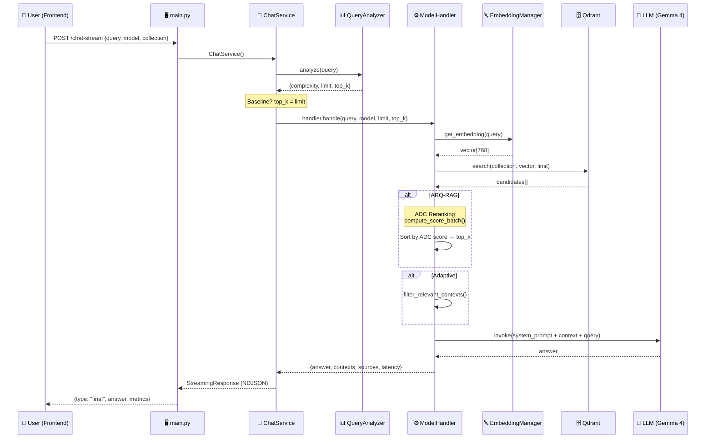
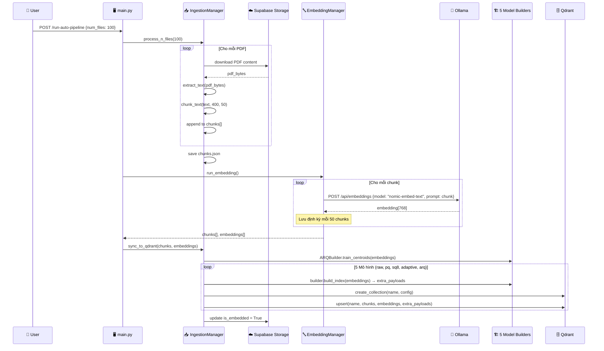
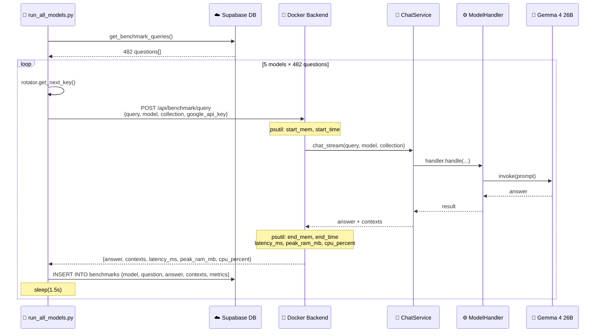
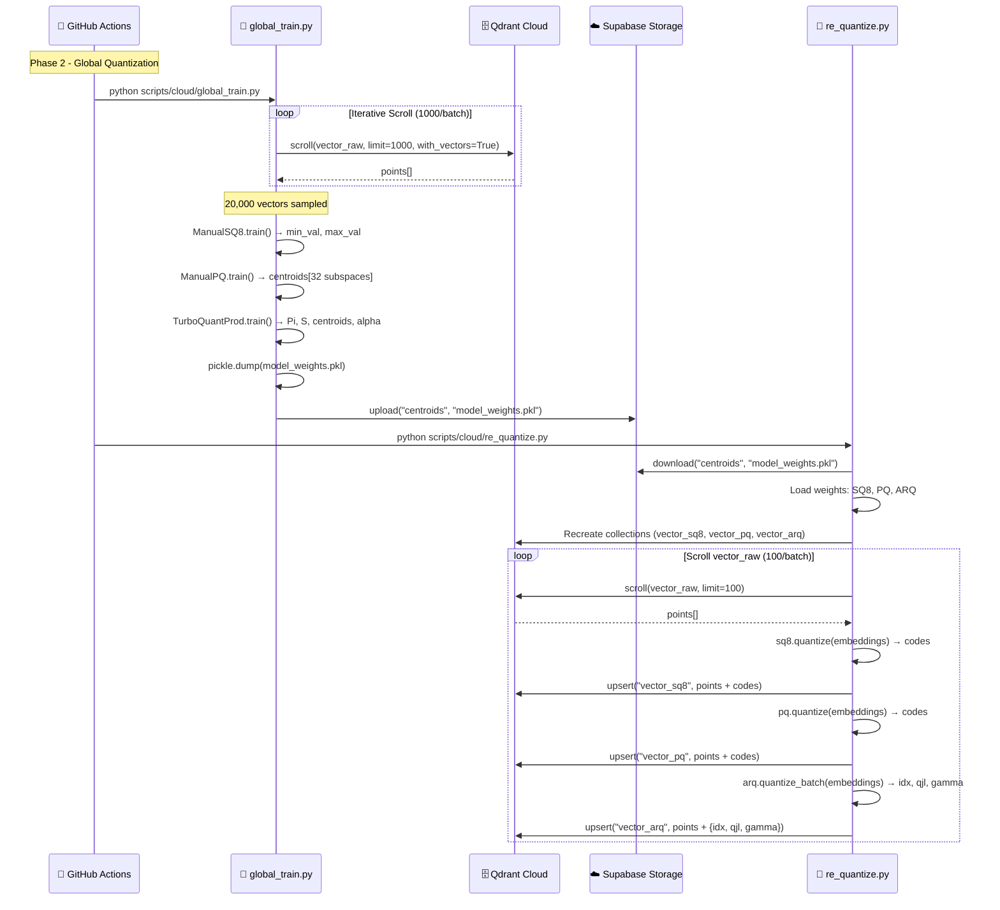
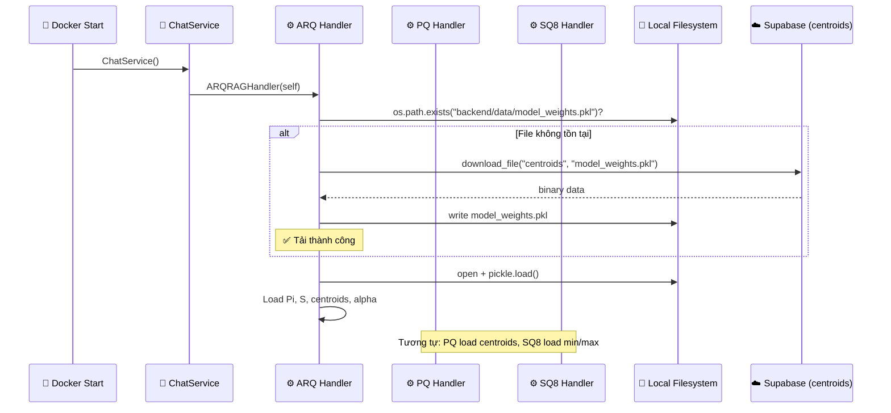

# ARQ-RAG Backend — Cấu trúc File & Luồng Hoạt động Chi tiết

> Tài liệu này mô tả toàn bộ kiến trúc backend, danh sách file, từng class/function, và luồng xử lý (sequence) cho hệ thống ARQ-RAG Benchmarking.

---

## 1. Tổng quan Cấu trúc Thư mục

```
backend/
├── main.py                          # FastAPI Entry Point (API Server)
├── chat_service.py                  # Điều phối Chat & Model Routing
├── ingest.py                        # Pipeline trích xuất PDF → Chunk → Qdrant
├── crawl_paper.py                   # Crawler ArXiv → Supabase Storage
├── export_excel.py                  # Xuất kết quả ra Excel (3 sheet)
├── .env                             # Biến môi trường (API Keys, URLs)
├── requirements.txt                 # Dependencies
├── Dockerfile                       # Docker build
├── models_list.json                 # Danh sách model metadata
│
├── models/                          # 5 Mô hình RAG
│   ├── shared_handler.py            # Handler dùng chung (StandardRAGHandler)
│   ├── arq_rag/                     # ARQ-RAG (TurboQuant + ADC Reranking)
│   │   ├── handler.py               #   ModelHandler — xử lý query
│   │   ├── quantization.py          #   TurboQuantMSE, TurboQuantProd
│   │   └── builder.py               #   ARQBuilder — huấn luyện & build index
│   ├── rag_pq/                      # RAG-PQ (Product Quantization)
│   │   ├── handler.py               #   ModelHandler
│   │   ├── quantization.py          #   ManualPQ
│   │   └── builder.py               #   PQBuilder
│   ├── rag_sq8/                     # RAG-SQ8 (Scalar Quantization 8-bit)
│   │   ├── handler.py               #   ModelHandler
│   │   ├── quantization.py          #   ManualSQ8
│   │   └── builder.py               #   SQ8Builder
│   ├── rag_raw/                     # RAG-RAW (Baseline — Full Precision)
│   │   ├── handler.py               #   ModelHandler
│   │   └── builder.py               #   RawBuilder
│   └── rag_adaptive/                # RAG-Adaptive (Dynamic top_k + Context Filter)
│       ├── handler.py               #   ModelHandler
│       └── builder.py               #   AdaptiveBuilder
│
├── shared/                          # Modules dùng chung
│   ├── supabase_client.py           # SupabaseManager — CRUD Database & Storage
│   ├── vector_store.py              # VectorStoreManager — Qdrant Client
│   ├── embed.py                     # EmbeddingManager — Ollama Embedding
│   ├── query_analyzer.py            # QueryAnalyzer — Phân loại độ phức tạp
│   ├── context_filter.py            # filter_relevant_contexts — Khử nhiễu
│
├── scripts/                         # Công cụ tự động hóa
│   ├── run_all_models.py            # SuperBenchmarkRunner — Siêu thực nghiệm
│   ├── generate_benchmark_queries.py # Sinh câu hỏi Ground Truth
│
├── data/                            # Dữ liệu runtime
│   ├── chunks.json                  # Các đoạn văn bản đã chunk
│   ├── embeddings.npy               # Vector embedding
│   ├── metadata.json                # Metadata quá trình ingest
│   └── model_weights.pkl            # Trọng số huấn luyện (Centroids, Min/Max)
│
├── results/                         # Kết quả benchmark
└── reports/                         # Báo cáo
```

---

## 2. Danh sách File & Chi tiết Function

---

### 2.1. `main.py` — FastAPI Entry Point

**Chức năng**: Server API chính, tiếp nhận mọi yêu cầu từ Frontend và điều phối xuống các module.

| Class / Function | Dòng | Mô tả |
|---|---|---|
| `UILogHandler.emit(record)` | 28 | Bắt log và đẩy vào hàng đợi `ui_log_queue` để Frontend hiển thị. Lọc bỏ log `/status` và log ChatService dưới mức ERROR. |
| `EndpointFilter.filter(record)` | 59 | Lọc bỏ log truy cập `/status` của uvicorn để tránh tràn console. |
| `GET /status` | 106 | Trả về trạng thái hệ thống (`state`), RAM usage (process + system), và 100 dòng log gần nhất. |
| `GET /pdfs` | 119 | Liệt kê tất cả file PDF trong bucket `papers` trên Supabase Storage. |
| `POST /run-ingest` | 125 | Kích hoạt background task to chạy `IngestionManager.process_n_files()`. Chuyển `state.status` → `INGESTING`. |
| `POST /run-embed` | 146 | Kích hoạt background task: `EmbeddingManager.run_embedding()` → `IngestionManager.sync_to_qdrant()`. Chuyển trạng thái `EMBEDDING` → `INDEXING`. |
| `POST /purge-data` | 176 | Xóa dữ liệu theo 3 mức: `all`, `vector`, `pdf`. Yêu cầu `secret_key` để xác thực. Xóa collection Qdrant, file local, bucket Supabase, và bảng database. |
| `POST /run-benchmark` | 254 | Kích hoạt `BenchmarkManager.run_batch()` với `ChatService`. Tải chunks/embeddings từ local, chạy đánh giá, upload kết quả Excel lên Supabase. |
| `POST /chat-stream` | 313 | Endpoint chat chính. Tạo `ChatService()`, gọi `cs.chat_stream()`, trả về `StreamingResponse` (NDJSON). |
| `POST /api/benchmark/query` | 330 | **Endpoint đo lường phòng thí nghiệm**. Đo `start_mem`, gọi `chat_stream`, đo `end_mem`, tính `latency_ms`, `peak_ram_mb`, `cpu_percent`. Hỗ trợ xoay tua API Key qua payload. |
| `POST /run-auto-pipeline` | 387 | Pipeline tự động 3 bước: Ingest → Embed → Sync to Qdrant. Có callback `on_ingest`, `on_embed` để cập nhật tiến độ. |
| `POST /run-generate-testset` | 434 | Chạy subprocess `scripts/generate_benchmark_queries.py` để sinh câu hỏi Ground Truth tự động. |

---

### 2.2. `chat_service.py` — Bộ não Điều phối

**Chức năng**: Nhận yêu cầu chat, phân tích độ phức tạp, chuyển tiếp đến đúng Model Handler, đo hiệu năng.

| Class / Function | Dòng | Mô tả |
|---|---|---|
| `ChatService.__init__()` | 30 | Khởi tạo `EmbeddingManager`, `VectorStoreManager`, `AdvancedEvaluator`, `QueryAnalyzer`, và 5 Model Handler (RAW, PQ, SQ8, Adaptive, ARQ). |
| `ChatService.get_llm(model_name)` | 46 | **Routing đa nền tảng**: Nếu model chứa `gemma-4` → Google GenAI. Nếu `gemini`/`gemma` → Google GenAI. Mặc định → Groq (`llama-3.1-8b-instant`). |
| `ChatService._extract_text(content)` | 80 | Trích xuất text thuần từ phản hồi LLM. Xử lý cả `str`, `list[dict]`, và `list[str]`. |
| `ChatService.chat_stream(query, model_name, collection_name)` | 95 | **Luồng chính**: (1) `QueryAnalyzer.analyze()` → lấy `limit`, `top_k`, `complexity`. (2) Nếu Baseline (`raw/pq/sq8`): `top_k = limit`. (3) Dispatch đến `handler.handle()`. (4) Đo `latency_ms`, `peak_ram_mb`. (5) Yield kết quả dạng NDJSON. |

---

### 2.3. `ingest.py` — Pipeline Trích xuất & Đồng bộ

**Chức năng**: Tải PDF từ Supabase → Trích xuất text → Chunk hóa → Đồng bộ lên Qdrant (5 collection).

| Class / Function | Dòng | Mô tả |
|---|---|---|
| `IngestionManager.__init__(data_dir)` | 18 | Khởi tạo `SupabaseManager`, `VectorStoreManager`, và registry 5 Model Builder (`RawBuilder`, `AdaptiveBuilder`, `PQBuilder`, `SQ8Builder`, `ARQBuilder`). |
| `load_metadata()` | 36 | Đọc file `metadata.json` để biết file nào đã xử lý. |
| `save_metadata(metadata)` | 42 | Lưu file `metadata.json`. |
| `extract_text(pdf_stream)` | 46 | Dùng PyMuPDF (`fitz`) để trích xuất text từ PDF binary stream. |
| `chunk_text(text, chunk_size, overlap)` | 53 | Chia text thành các đoạn 400 từ, chồng lấp 50 từ. |
| `process_n_files(n, on_progress)` | 61 | Lấy `n` file chưa xử lý từ Supabase `papers` bucket → trích xuất → chunk → lưu `chunks.json`. |
| `sync_to_qdrant(chunks, embeddings)` | 110 | **Đồng bộ 5 mô hình**: (1) Huấn luyện ARQ centroids. (2) Lặp qua 5 builder: tạo collection → build index → upsert. (3) Cập nhật `is_embedded=True` cho các paper đã xử lý. |

---

### 2.4. `benchmark.py` — Quản lý Benchmark

**Chức năng**: Chạy benchmark theo đợt (batch), ghi kết quả ra Excel, upload lên Supabase.

| Class / Function | Dòng | Mô tả |
|---|---|---|
| `BenchmarkManager.__init__(embeddings, chunks)` | 14 | Khởi tạo với dữ liệu embedding và chunks đã có sẵn. |
| `get_current_ram()` | 24 | Đo RAM hiện tại của process (MB). |
| `load_queries(file_path)` | 28 | Tải câu hỏi Ground Truth: ưu tiên Supabase DB → fallback file JSON local. |

---

### 2.5. `crawl_paper.py` — Crawler ArXiv

**Chức năng**: Tự động cào bài báo khoa học từ ArXiv theo 6 chủ đề nghiên cứu.

| Class / Function | Dòng | Mô tả |
|---|---|---|
| `clean_filename(s)` | 39 | Loại bỏ ký tự đặc biệt khỏi tên file. |
| `extract_id(url)` | 42 | Trích xuất ArXiv ID từ URL. |
| `check_stop_signal()` | 47 | Kiểm tra tín hiệu dừng từ bảng `system_config` trên Supabase. |
| `crawl_arxiv()` | 57 | Cào bài theo 6 chủ đề (TurboQuant, ARQ, PQ, RAG, ML_Optimization, LLM_Inference). Mỗi topic lấy tối đa 300 bài. Phân trang 100 bài/request. Delay 8-12s giữa mỗi bài. Upload PDF → Supabase Storage, metadata → Database. |

---

### 2.6. `export_excel.py` — Xuất Excel

| Function | Dòng | Mô tả |
|---|---|---|
| `export_to_excel(results, output_file)` | 4 | Tạo file Excel với 3 sheet: **Query_Level** (chi tiết từng câu), **TestSet_Level** (tổng hợp theo TestSet), **Summary** (tổng hợp theo mô hình). |

---

## 3. Thư mục `models/` — 5 Kiến trúc RAG

---

### 3.1. `models/arq_rag/` — ARQ-RAG (Đề xuất chính)

#### `quantization.py`
| Class / Function | Mô tả |
|---|---|
| `TurboQuantMSE.__init__(d, b)` | Khởi tạo: tạo ma trận chiếu ngẫu nhiên Pi (d×d) bằng QR decomposition. Centroids = zeros. |
| `TurboQuantMSE.quantize_batch(X)` | Chiếu X qua Pi.T, tìm centroid gần nhất cho mỗi chiều → trả về chỉ số `idx`. |
| `TurboQuantMSE.dequantize_batch(idx)` | Tra bảng centroids[idx], chiếu ngược qua Pi → vector xấp xỉ. |
| `TurboQuantProd.__init__(d, b)` | Kế thừa TurboQuantMSE. Thêm ma trận S (Johnson-Lindenstrauss) và hệ số alpha. |
| `TurboQuantProd.quantize_batch(X)` | (1) Lượng hóa MSE → `idx`. (2) Tính Residual `R = X - X̃`. (3) Chiếu JL: `qjl = sign(R·S^T)`. (4) Gamma = ‖R‖₂. |
| `TurboQuantProd.compute_score_batch(query, idx, qjl, gamma, orig_norms)` | **ADC Scoring**: `score = centroids[idx]·(Pi·q) + α·γ·(qjl·(S·q))`. Nhân với orig_norms nếu có. |

#### `handler.py`
| Function | Mô tả |
|---|---|
| `__init__(chat_service)` | Khởi tạo TurboQuantProd. **Self-healing**: Nếu thiếu `model_weights.pkl` → tự tải từ Supabase bucket `centroids`. Load trọng số ARQ (Pi, S, centroids, alpha). |
| `handle(query, model_name, limit, top_k)` | (1) Embed query → vector. (2) Qdrant search `vector_arq` → candidates. (3) **ADC Reranking**: extract idx/qjl/gamma → `compute_score_batch()` → sort → top_k. (4) Context Filter. (5) LLM Generation với prefix `[ARQ-RAG]`. |

#### `builder.py`
| Function | Mô tả |
|---|---|
| `get_storage_config()` | INT8 Scalar Quantization + HNSW (ef=512, m=32). |
| `train_centroids(embeddings)` | Normalize → chiếu Pi.T → Faiss K-Means → lưu `centroids.npy`. |
| `build_index(embeddings)` | Normalize → `quantize_batch()` → trả `{idx, qjl, gamma, orig_norm}`. |

---

### 3.2. `models/rag_pq/` — Product Quantization

#### `quantization.py`
| Class / Function | Mô tả |
|---|---|
| `ManualPQ.__init__(d, m, nbits)` | Chia vector d=768 thành m=32 sub-space (24 dim mỗi sub). k=256 centroids/sub. |
| `ManualPQ.train(X)` | Huấn luyện Faiss K-Means cho từng sub-space. Fallback nếu ít dữ liệu. |
| `ManualPQ.quantize(X)` | Gán mỗi sub-vector về centroid gần nhất → codes uint8. |
| `ManualPQ.compute_adc_scores(query, codes)` | ADC: Tính bảng khoảng cách query-to-centroids, tra codes → tổng khoảng cách. |

#### `handler.py`
| Function | Mô tả |
|---|---|
| `__init__(chat_service)` | Khởi tạo ManualPQ. **Self-healing**: Tải/nạp centroids từ `model_weights.pkl`. |
| `handle(query, model_name, limit, top_k)` | Embed → Qdrant search `vector_pq` → lấy top_k trực tiếp (không rerank) → LLM Generation với prefix `[RAG-PQ]`. |

---

### 3.3. `models/rag_sq8/` — Scalar Quantization 8-bit

#### `quantization.py`
| Class / Function | Mô tả |
|---|---|
| `ManualSQ8.__init__(d)` | `min_val`, `max_val` = None. |
| `ManualSQ8.train(X)` | Tìm Min/Max toàn cục. Xử lý chia cho 0. |
| `ManualSQ8.quantize(X)` | Scale X về [0,1] → nhân 255 → uint8. |
| `ManualSQ8.compute_scores(query, codes)` | Scale query → int, tính L2 distance với codes. |

#### `handler.py`
| Function | Mô tả |
|---|---|
| `__init__(chat_service)` | Khởi tạo ManualSQ8. **Self-healing**: Tải/nạp Min/Max từ `model_weights.pkl`. |
| `handle(query, model_name, limit, top_k)` | Embed → Qdrant search `vector_sq8` → top_k trực tiếp → LLM Generation với prefix `[RAG-SQ8]`. |

---

### 3.4. `models/rag_raw/` — Baseline Full Precision

#### `handler.py`
| Function | Mô tả |
|---|---|
| `__init__(chat_service)` | Chỉ khởi tạo VectorStoreManager. Không cần trọng số. |
| `handle(query, model_name, limit, top_k)` | Embed → Qdrant search `vector_raw` → top_k trực tiếp → LLM Generation với prefix `[RAG-RAW]`. |

---

### 3.5. `models/rag_adaptive/` — Adaptive Dynamic Retrieval

#### `handler.py`
| Function | Mô tả |
|---|---|
| `__init__(chat_service)` | Chỉ khởi tạo VectorStoreManager. |
| `handle(query, model_name, limit, top_k)` | Embed → Qdrant search `vector_raw` **(dùng chung collection với RAW)** → top_k → **Context Filter** (`filter_relevant_contexts`) → LLM Generation với prefix `[RAG-Adaptive]`. |

---

### 3.6. `models/shared_handler.py` — Handler Chung

| Function | Mô tả |
|---|---|
| `StandardRAGHandler.__init__(cs, collection, label)` | Handler tổng quát với tên collection và label tùy chỉnh. |
| `handle(query, model_name, limit, top_k)` | Luồng giống RAW nhưng thêm Context Filter. MAX_CONTEXT_CHARS = 24,000. |

---

## 4. Thư mục `shared/` — Modules Dùng chung

---

### 4.1. `supabase_client.py` — SupabaseManager

| Function | Dòng | Mô tả |
|---|---|---|
| `__init__()` | 10 | Kết nối Supabase. Lấy key từ `SUPABASE_KEY` hoặc `SUPABASE_SERVICE_ROLE_KEY`. |
| `list_files(bucket)` | 19 | Liệt kê file trong bucket, phân trang 100/lần. |
| `set_stop_signal(should_stop)` | 48 | Ghi tín hiệu dừng crawler vào bảng `system_config`. |
| `check_stop_signal()` | 60 | Đọc tín hiệu dừng. |
| `upsert_paper(id, title, topic, url)` | 74 | Lưu/cập nhật metadata bài báo. |
| `update_paper_embedded_status(id, status)` | 89 | Đánh dấu bài báo đã embed. |
| `get_paper_metadata(id)` | 97 | Lấy metadata 1 bài. |
| `get_all_papers()` | 108 | Lấy toàn bộ danh sách bài. |
| `download_file(bucket, filename, destination)` | 118 | Tải file từ Supabase Storage về local. |
| `get_file_content(bucket, filename)` | 127 | Lấy nội dung file (binary). |
| `upload_file(bucket, filename, file_path)` | 132 | Upload file lên Storage (upsert). |
| `clear_bucket(bucket)` | 145 | Xóa toàn bộ file trong bucket (vòng lặp 100/batch). |
| `get_public_url(bucket, filename)` | 173 | Lấy URL công khai. |
| `clear_database_table(table_name)` | 178 | Xóa toàn bộ dữ liệu trong bảng. |
| `get_query_cache(query_text)` | 191 | Tra cache phân loại. |
| `set_query_cache(query_text, complexity)` | 202 | Lưu cache phân loại. |
| `get_benchmark_queries()` | 214 | Lấy danh sách câu hỏi Ground Truth. |
| `save_benchmark_queries(queries)` | 224 | Upsert danh sách câu hỏi (bulk). |
| `save_single_benchmark_query(...)` | 244 | Lưu 1 câu hỏi (stream mode). |

---

### 4.2. `vector_store.py` — VectorStoreManager

| Function | Mô tả |
|---|---|
| `__init__(host, port)` | Kết nối Qdrant tại `qdrant:6333`. Vector size = 768. |
| `create_collection_modular(name, config)` | Tạo collection mới nếu chưa tồn tại. Nhận quantization + hnsw config từ builder. |
| `upsert_collection(name, chunks, embeddings, extra_payloads)` | Tạo PointStruct cho mỗi chunk + vector + payload. Upsert vào Qdrant. |
| `search(collection, query_vector, limit)` | Tìm kiếm vector gần nhất, trả về points kèm payload. |
| `delete_all_collections(collections)` | Xóa 5 collection mặc định. |

---

### 4.3. `embed.py` — EmbeddingManager

| Function | Mô tả |
|---|---|
| `__init__(data_dir, ollama_url)` | Kết nối Ollama (`nomic-embed-text`). Mặc định `ollama:11434`. |
| `get_embedding(text)` | Gọi API Ollama `/api/embeddings` → vector 768 chiều. Fallback random nếu lỗi. |
| `run_embedding(on_progress)` | Embed toàn bộ chunks. Resume nếu đã có embeddings cũ. Lưu định kỳ mỗi 50 chunks. |
| `load_embeddings()` | Đọc `embeddings.npy` nếu tồn tại. |

---

### 4.4. `query_analyzer.py` — QueryAnalyzer

| Function | Mô tả |
|---|---|
| `__init__()` | Khởi tạo Groq LLM (`llama-3.1-8b-instant`) + SupabaseManager (cache). |
| `analyze(query)` | (1) Kiểm tra Supabase cache. (2) Nếu miss → gọi LLM phân loại. (3) Map nhãn → config: EASY(20/5), NORMAL(50/10), HARD(80/20), EXTREME(120/30). |
| `_classify_with_llm(query)` | Prompt LLM trả về đúng 1 từ: EASY/NORMAL/HARD/EXTREME. |

---

### 4.5. `context_filter.py` — Bộ lọc Ngữ cảnh

| Function | Mô tả |
|---|---|

---


| Function | Mô tả |
|---|---|
| `AdvancedEvaluator.evaluate(query, contexts, answer)` | Tạo LLMTestCase → đo faithfulness + answer_relevancy. |

---

### 4.7. `batch_evaluator.py` — BatchEvaluator

| Function | Mô tả |
|---|---|
| `KeyRotator.__init__(keys)` | Quản lý danh sách API Key, xoay vòng. |
| `BatchEvaluator.__init__()` | Khởi tạo GeminiModel (`gemini-3.1-flash-lite-preview`) làm Judge. Metrics: Faithfulness + AnswerRelevancy. |
| `run_benchmark_eval(limit)` | Quét bảng `benchmarks` tìm dòng chưa có điểm → chấm → cập nhật lại DB. |

---

## 5. Thư mục `scripts/` — Tự động hóa

---

### 5.1. `run_all_models.py` — Siêu Thực nghiệm

| Function | Mô tả |
|---|---|
| `KeyRotator.__init__(keys)` | Xoay tua API Key (GOOGLE_API_KEY + GOOGLE_API_KEY_2). |
| `SuperBenchmarkRunner.__init__()` | Khởi tạo 5 model targets, sử dụng `gemma-4-26b-it`. |
| `run_single_test(model_label, question_data)` | Gửi HTTP POST đến `localhost:8000/api/benchmark/query` với payload {query, model, collection, google_api_key}. Nhận kết quả + metrics. Lưu vào bảng `benchmarks` trên Supabase. |
| `start_all()` | Lấy toàn bộ câu hỏi từ `benchmark_queries`. Lặp: 5 model × N câu hỏi. Delay 1.5s (đa key) hoặc 3s (đơn key). |

---

### 5.2. `generate_benchmark_queries.py` — Sinh Ground Truth

| Function | Mô tả |
|---|---|
| `CloudBenchmarkGenerator.__init__()` | Kết nối Qdrant Cloud, tạo payload index cho `topic`. Dùng Gemini 3.1 Flash Lite sinh câu hỏi. |
| `get_random_chunks_from_qdrant(topic, limit)` | Scroll `vector_raw` lọc theo topic → random sample. |
| `run(target_per_topic)` | 6 topics × 85 câu/topic. Nạp 100 chunks/lần → prompt LLM → parse JSON → lưu Supabase. Delay 30s. |

---

## 6. Luồng Hoạt động (Sequence Diagrams)

---

### 6.1. Luồng Chat (User → Answer)



---

### 6.2. Luồng Ingestion (PDF → Qdrant)



---

### 6.3. Luồng Super-Benchmark (Laboratory-Grade)



---

### 6.4. Luồng Phase 2 — Quantization (Cloud)



---

### 6.5. Luồng Self-Healing (Tự phục hồi Trọng số)



---

## 7. Bảng Tổng hợp 5 Mô hình

| Mô hình | Collection | Quantization | Reranking | Context Filter | Trọng số cần thiết |
|---|---|---|---|---|---|
| **RAG-RAW** | `vector_raw` | Không | Không | Không | Không |
| **RAG-PQ** | `vector_pq` | Product Quantization (32 sub, 256 centroids) | Không | Không | PQ centroids |
| **RAG-SQ8** | `vector_sq8` | Scalar 8-bit (Min/Max scaling) | Không | Không | SQ8 min/max |
| **RAG-Adaptive** | `vector_raw`* | Không | Không | ✅ `filter_relevant_contexts` | Không |
| **ARQ-RAG** | `vector_arq` | TurboQuant (MSE + JL Projection) | ✅ ADC Scoring | ✅ `filter_relevant_contexts` | ARQ (Pi, S, α, centroids) |

> *RAG-Adaptive dùng chung collection `vector_raw` nhưng áp dụng lọc ngữ cảnh thông minh.

---

## 8. Các Bảng Database (Supabase)

| Bảng | Mục đích |
|---|---|
| `papers` | Metadata bài báo (id, title, topic, url, is_embedded) |
| `benchmark_queries` | Câu hỏi Ground Truth (question, ground_truth, topic, source_files) |
| `benchmarks` | Kết quả thực nghiệm (model_name, question, answer, contexts, latency_ms, peak_ram_mb, ...) |
| `query_cache` | Cache phân loại độ phức tạp (query_text → complexity) |
| `system_config` | Cấu hình hệ thống (crawler_stop_signal, ...) |

---

## 9. Các Bucket Storage (Supabase)

| Bucket | Nội dung |
|---|---|
| `papers` | File PDF bài báo từ ArXiv |
| `centroids` | File `model_weights.pkl` (trọng số huấn luyện SQ8/PQ/ARQ) |
| `benchmark-excel` | Kết quả benchmark dạng Excel |
